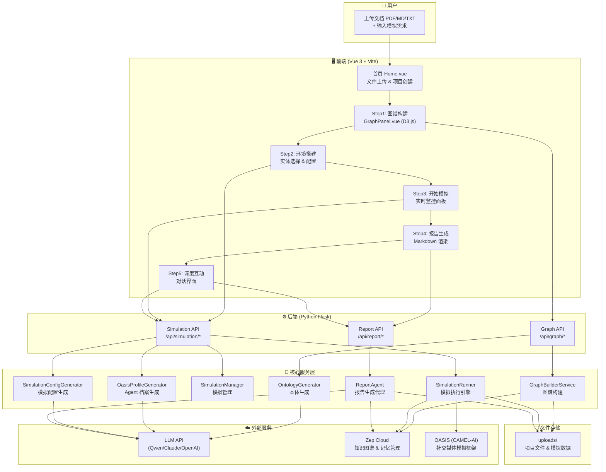
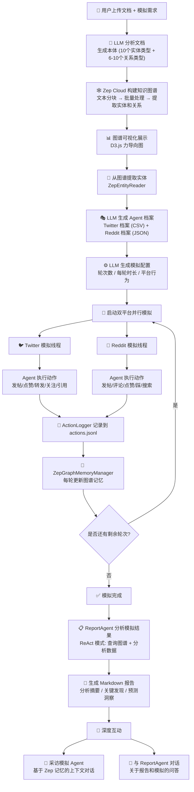
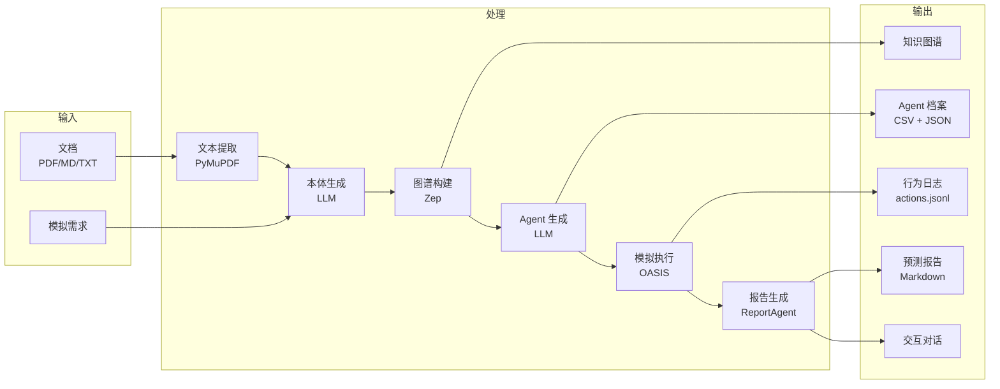
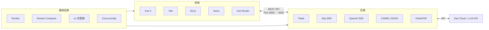
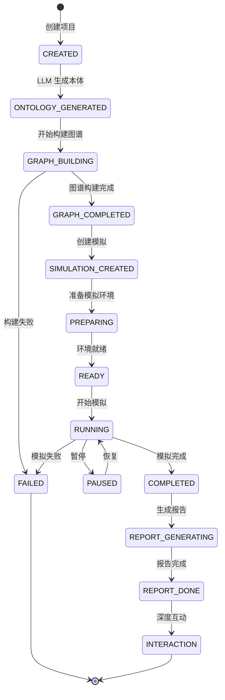

# MiroFish 项目架构流程图

## 整体架构

## 核心业务流程

## 数据流图

## 技术栈

## 项目状态机

---

> 使用方法: 将此文件内容粘贴到 [Mermaid Live Editor](https://mermaid.live) 或任何支持 Mermaid 的 Markdown 渲染器中查看。
>
> 支持渲染的工具: GitHub、VS Code (Markdown Preview Mermaid)、Notion、Typora 等。
